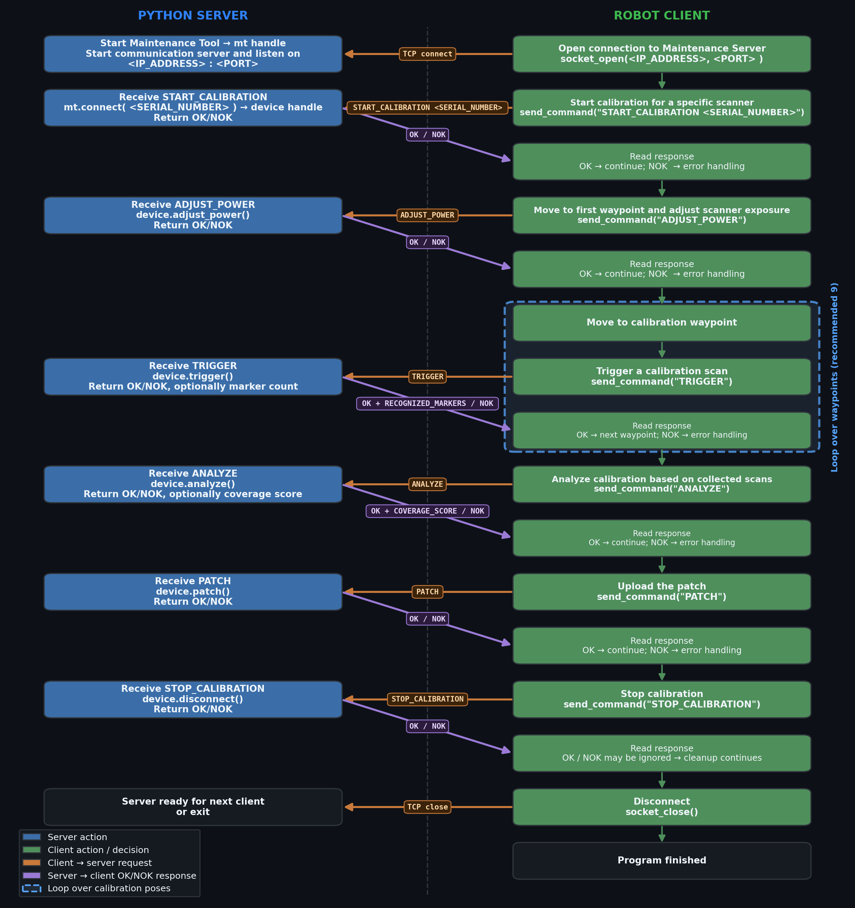

# Photoneo Maintenance Tool – API Reference & Procedure Flowchart

---

## API Reference

| Function | Description | Input | Output |
|---|---|---|---|
| `MaintenanceTool()` | Create the Python wrapper and load the native MaintenanceTool library. | `PHOXI_CONTROL_PATH` environment variable | `MaintenanceTool` instance (named `mt` below). Raises `PhoXiError` if library cannot be loaded. |
| `mt.get_maintenance_tool_api_version()` | Read the loaded MaintenanceTool API version. | — | Tuple `(major, minor, patch)` |
| `mt.check_phoxi_control_compatibility()` | Check whether the installed PhoXi Control is compatible with the MaintenanceTool API. | — | `Bool` — `True` if compatible, `False` otherwise. |
| `mt.connect(...)` | Connect to a PhoXi device and create an active maintenance session. | `serial_number: str` `output_directory_path: str \| None` `validation_target_path: str \| None` `store_praw_files: bool` | `MaintenanceToolDevice` handle (named `device` below). Raises `PhoXiError` on connection failure. |
| `device.disconnect()` | Disconnect the active device session. | — | `None`. Raises `PhoXiError` if no device is connected. |
| `device.adjust_power()` | Adjust laser power and LED intensity for suitable exposure. | — | `None`. Raises `PhoXiError` if adjustment fails. |
| `device.trigger()` | Acquire one calibration scan at the current robot pose. | — | `TriggerResult` `.count_of_recognized_marker_points: int` `.count_of_acquired_scans: int` |
| `device.analyze()` | Analyze acquired scans and determine whether a correction patch can be prepared. | — | `Float` — area / coverage occupancy score. Raises `PhoXiError` if criteria are not fulfilled. |
| `device.patch()` | Apply the prepared correction patch to the device. | — | `None`. Raises `PhoXiError` if patch was not prepared or patching fails. |
| `device.restore()` | Restore the device to factory calibration. | — | `None`. Raises `PhoXiError` if restore fails. |

---

## Calibration Procedure Flowchart

